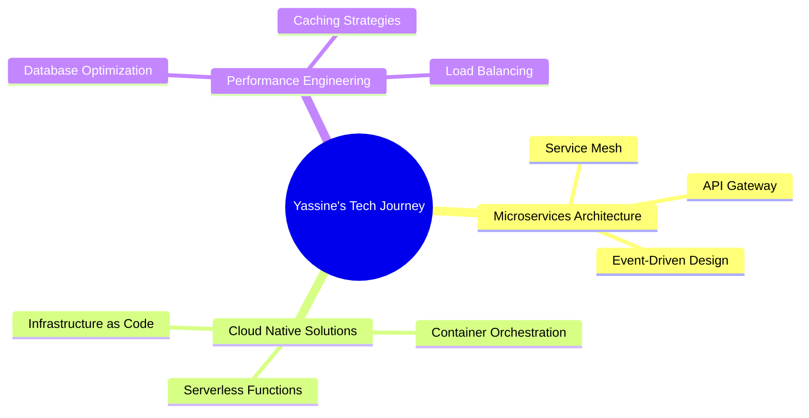

# 🚀 Zoubairi Yassine | Software Engineer & Full Stack Developer

<div align="center">
  
</div>

<div align="center">
  
</div>

---

## 🎯 Professional Summary

<table>
<tr>
<td width="50%">

### 🌟 What Drives Me
```typescript
const yassine = {
  role: "Software Engineer & Full Stack Developer",
  focus: ["Backend Systems", "Full Stack Solutions"],
  passion: "Building software that makes a difference",
  philosophy: "Clean code is not written by following rules, 
              but by deeply caring about craft",
  currentGoal: "Mastering modern development practices"
}
```

</td>
<td width="50%">

### 📊 Quick Stats
- 🏢 **4+ Years** of professional development
- ⚡ **15+ Projects** successfully delivered
- 🌍 **3 Languages** (Arabic, French, English)
- 🎯 **Backend-focused** with full-stack capabilities
- 📈 Always **performance-oriented**

</td>
</tr>
</table>

---

## 🛡️ Technical Arsenal

### Core Technologies
<div align="center">

| **Backend Mastery** | **Frontend Excellence** | **Mobile Development** |
|:---:|:---:|:---:|
|   |   |   |
|   |   |  |

</div>

### Advanced Infrastructure & DevOps
<div align="center">


</div>

### Database Expertise
<div align="center">


</div>

---

## 📈 Performance Dashboard

<div align="center">
<table>
<tr>
<td width="50%">
  
</td>
<td width="50%">
  
</td>
</tr>
</table>
</div>

### 💻 Code Distribution
<div align="center">
  
</div>

---

## 🏆 Achievements & Recognition

<div align="center">
  
</div>

<details>
<summary><b>🎖️ Click to expand detailed achievements</b></summary>

| Achievement | Description | Points |
|:---:|:---:|:---:|
| 🌈 **Multi Language Master** | Proficient in 7+ programming languages | 15pt |
| 🚀 **Commit Streak Champion** | Consistent daily contributions | 438pt |
| 📚 **Repository Creator** | 31 diverse projects and counting | 31pt |
| 💫 **Community Builder** | Growing network of developer connections | 19pt |
| ⭐ **Code Quality Advocate** | Projects that inspire others | 7pt |

</details>

---

## 🔥 Featured Projects & Contributions

<div align="center">

### 🎯 Current Focus Areas


</div>

---

## 📱 Let's Connect & Collaborate

<div align="center">

### 🌐 Professional Network
[](https://www.linkedin.com/in/yassine-zoubairi-390b9b268/)
[](mailto:yassinezoubairi7@gmail.com)
[](https://wa.me/212624497376?text=Hello!%20I%20would%20like%20to%20connect%20with%20you.)

### 💼 Open for Opportunities
- 🚀 **Full Stack Development** projects
- 🏗️ **System Architecture** consultations  
- 🤝 **Open Source** collaborations
- 💡 **Tech Mentorship** and knowledge sharing

</div>

---

<div align="center">

### 💭 Philosophy

> *"The best code is not just functional—it's elegant, maintainable, and tells a story. Every line should serve a purpose, every function should have dignity, and every system should be built to last."*

---


**✨ Crafted with passion, precision, and endless curiosity ✨**  
*Building tomorrow's software today* • *Made in Morocco* 🇲🇦


</div>
